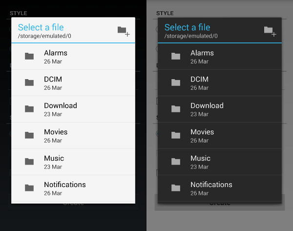

# file-selector

*A minimal, holo-themed file picker.*



## Features

* Light and dark themes
* Full-screen activity and dialog modes
* Select files or folders, and filter by type

## Usage

### With Gradle:

```groovy
compile 'co.arcs.android:file-selector:1.0.1@aar'
```

This isn't on maven central (yet), so you'll also need to add the repository:

```groovy
repositories {
    mavenCentral( 
    maven {
        url "https://arcs.co/archiva/repository/external/"
    }
}
```

### With Eclipse:

1. Clone the project
2. 'Import' -> 'Existing Android Code into Workspace'

## Backlog

* Support filter by file extension
* Hide 'new folder' button when selecting a file (as doesn't make sense)

## Contributing

Pull requests / bug reports are most welcome.

## Licence

[Apache 2.0](https://www.apache.org/licenses/LICENSE-2.0.html)


 